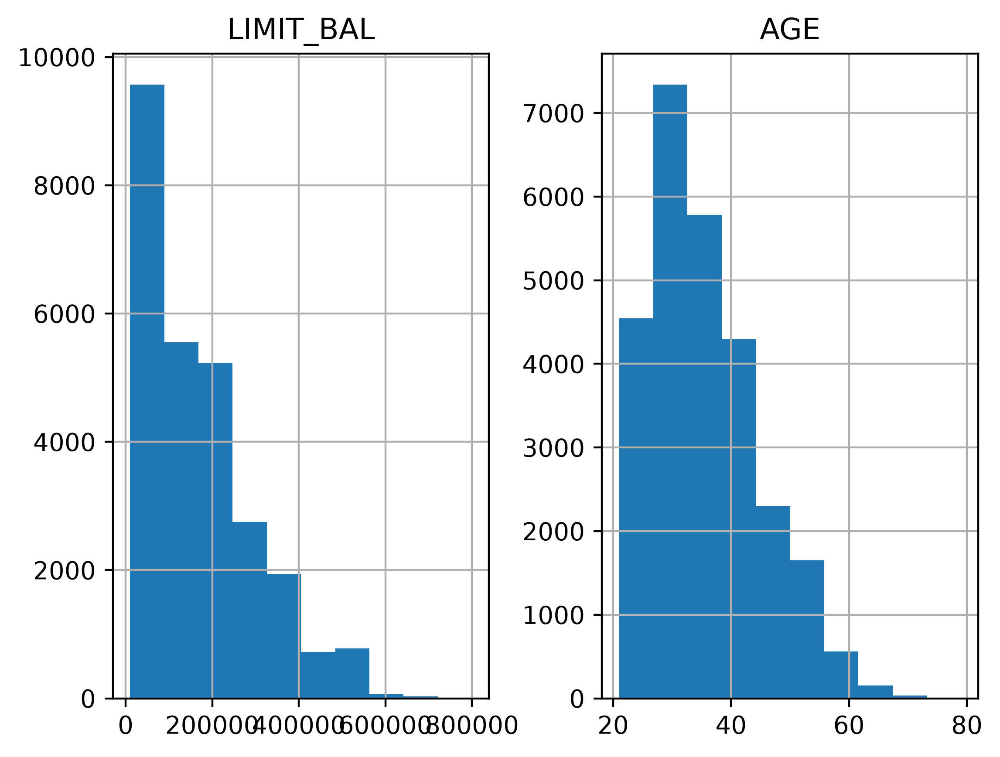
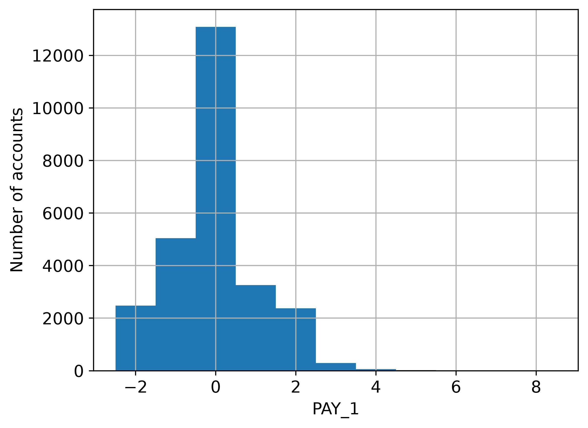
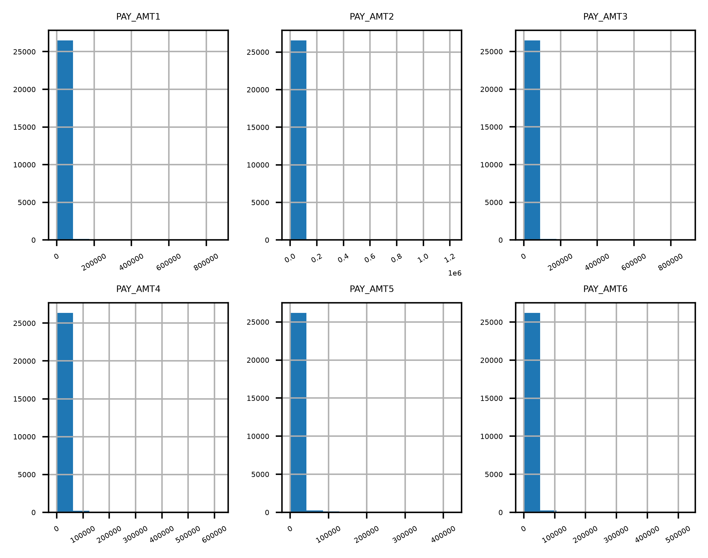
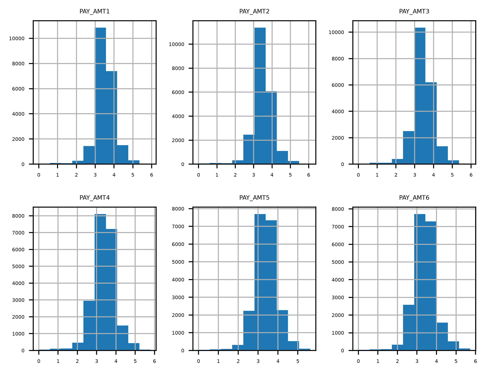

> **Estudo concluído.** Este repositório faz parte de uma série de seis estudos baseados em livro. Consulte o [índice da série](https://github.com/JVCSampaio/data-science-projects) e o [portfólio](https://github.com/JVCSampaio) para os projetos em destaque.

# Projeto 1 — Exploração de Dados com Pandas e Matplotlib

Exploração visual e estatística de um dataset real de cartões de crédito (UCI Machine Learning Repository), preparando a base de dados para os projetos de modelagem que seguem a sequência.

**Fonte do projeto:** livro *Projetos de Ciência de Dados com Python* — Stephen Klosterman (Novatec Editora, 2020), Lição 1.

## Sobre os dados

- **Dataset:** [default of credit card clients](https://www.kaggle.com/uciml/credit-card-default-dataset) (UCI)
- **Volume:** 5.333 registros × 23 variáveis
- **Alvo:** `default payment next month` (1 = inadimplente no mês seguinte)
- **Variáveis principais:** limite do cartão (`LIMIT_BAL`), valores pagos (`PAY_AMT`), renda (`AGE`, `EDUCATION`)

## O que foi feito

1. Carregamento e limpeza dos dados com `pandas` (tratamento de dados faltantes e de variáveis categóricas codificadas).
2. Resumo estatístico das distribuições: histogramas das variáveis de pagamento (`PAY_AMT`), faturamento e limite do cartão.
3. Análise de correlação entre `LIMIT_BAL` e `AGE` e relação entre nível de educação e taxa de inadimplência.
4. Análise da assimetria das variáveis de pagamento e uso de escala logarítmica (`log10`) para visualizar melhor a cauda das distribuições.

## Resultados principais









## Estrutura do repositório

| Caminho | Conteúdo |
|---|---|
| `exploracao_dados.ipynb` | Notebook completo, já executado (todas as saídas e gráficos) |
| `Data/` | Datasets: `Chapter_1_cleaned_data.csv` e `default_of_credit_card_clients__courseware_version_1_21_19.xls` |
| `img/` | Figuras extraídas do notebook para o README |

## Como executar

```bash
pip install pandas numpy matplotlib seaborn xlrd
jupyter notebook exploracao_dados.ipynb
```

## Dependências

`pandas 1.5.3`, `numpy 1.24.4`, `matplotlib 3.7.5`, `seaborn 0.13.2`, `xlrd`
